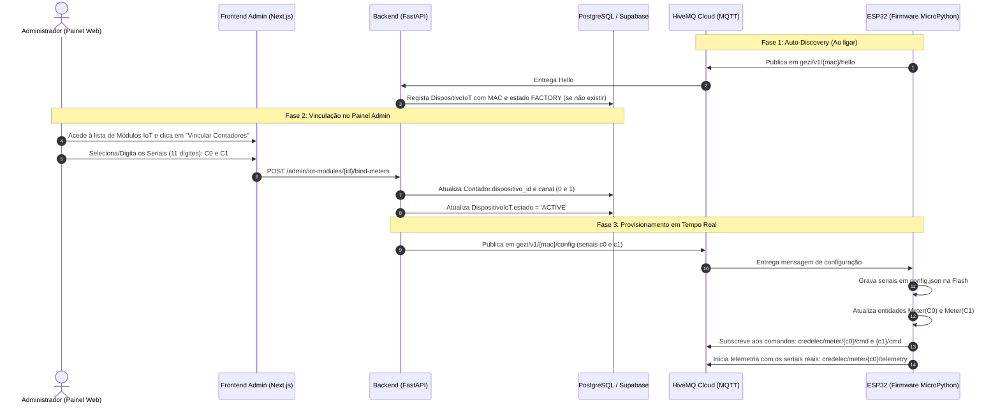

# Guia de Provisionamento e Vinculação de Contadores (Admin Web ↔ Backend ↔ Firmware)

Este documento descreve a arquitetura e o passo a passo de implementação para permitir que o administrador, através do **Painel Web (Next.js/React)**, vincule contadores com números de série decimais (até 11 dígitos) a um módulo físico **ESP32 (identificado pelo MAC Address)**, fazendo com que o **Backend (FastAPI)** atualize a base de dados e notifique o **Firmware (MicroPython)** via **MQTT** em tempo real.

---

## 1. Visão Geral da Arquitetura

O ecossistema divide a identidade física e lógica:
* **Módulo Físico IoT (`DispositivoIoT`):** Identificado de fábrica pelo seu **MAC Address** único (ex: `6c:c8:40:77:62:c8`).
* **Contadores Lógicos (`Contador`):** Identificados pelo **Número de Série** decimal de até 11 dígitos (ex: `10482910392` e `10482910393`), associados a um canal físico (`canal = 0` para C0 e `canal = 1` para C1).



---

## 2. Parte 1: Painel Web Administrativo (Frontend)

### 2.1. Onde isto acontece na UI
No menu **Gestão de Hardware / Módulos IoT** (`/admin/iot-modules`):
1. A tabela lista os módulos descobertos pelo `Hello` com colunas:
   - **MAC Address:** `6c:c8:40:77:62:c8`
   - **Versão do Firmware:** `v1.2.0-dual`
   - **Estado:** Badge `FACTORY` (amarelo) ou `ACTIVE` (verde)
   - **Último Visto (Heartbeat):** Há 2 minutos
   - **Contadores Associados:** `Sem contadores` ou `C0: 10482910392 | C1: 10482910393`
   - **Ações:** Botão `[Vincular Contadores]` ou `[Editar Associação]`

### 2.2. Modal de Vinculação (`BindMetersModal.tsx`)
O modal apresenta um formulário com validação:
- **Dispositivo:** Mostra o MAC selecionado e ID (apenas leitura).
- **Contador Canal 0 (C0):**
  - Campo numérico de texto com máscara/validação: `^[0-9]{1,11}$`.
  - Placeholder: `Ex: 10482910392`.
- **Contador Canal 1 (C1):**
  - Campo numérico de texto com máscara/validação: `^[0-9]{1,11}$`.
  - Placeholder: `Ex: 10482910393`.
- **Validações no Frontend:**
  - O número de série deve ser puramente numérico (dígitos positivos).
  - Máximo de 11 dígitos.
  - C0 e C1 não podem ser iguais.

### 2.3. Exemplo de Chamada API no Frontend (TypeScript / React)

```typescript
// Exemplo em Next.js / React
export async function bindMetersToDevice(
  deviceId: string,
  meterSerialC0: string,
  meterSerialC1: string
) {
  const response = await fetch(`/v1/admin/iot-modules/${deviceId}/bind-meters`, {
    method: 'POST',
    headers: {
      'Content-Type': 'application/json',
      'Authorization': `Bearer ${adminToken}`,
    },
    body: JSON.stringify({
      meter_serial_c0: meterSerialC0.trim(),
      meter_serial_c1: meterSerialC1.trim(),
    }),
  });

  if (!response.ok) {
    const errorData = await response.json();
    throw new Error(errorData.detail || 'Falha ao vincular contadores');
  }

  return await response.json();
}
```

---

## 3. Parte 2: Backend (FastAPI)

### 3.1. Schema Pydantic de Entrada (`schemas.py`)
Valida o formato decimal de até 11 dígitos:

```python
from pydantic import BaseModel, Field, field_validator

class BindMetersRequest(BaseModel):
    meter_serial_c0: str = Field(..., description="Serial decimal do Canal 0 (até 11 dígitos)")
    meter_serial_c1: str = Field(..., description="Serial decimal do Canal 1 (até 11 dígitos)")

    @field_validator("meter_serial_c0", "meter_serial_c1")
    @classmethod
    def validate_meter_serial(cls, v: str) -> str:
        s = v.strip()
        if not s.isdigit():
            raise ValueError("O número de série deve conter apenas dígitos numéricos.")
        if len(s) > 11:
            raise ValueError("O número de série não pode exceder 11 dígitos.")
        return s

    @field_validator("meter_serial_c1")
    @classmethod
    def validate_different_serials(cls, v: str, values) -> str:
        c0 = values.data.get("meter_serial_c0")
        if c0 and v.strip() == c0.strip():
            raise ValueError("Os contadores dos canais 0 e 1 devem ser distintos.")
        return v
```

### 3.2. Endpoint no Router Admin (`app/modules/iot/presentation/controllers/admin.py`)

```python
@router.post("/iot-modules/{device_id}/bind-meters", status_code=200)
def bind_meters_to_device(
    device_id: uuid.UUID,
    data: BindMetersRequest,
    admin_user: AuthUser = Depends(get_admin_user),
    db: Session = Depends(get_db),
):
    """
    Vincula os contadores aos Canais 0 e 1 do módulo físico IoT.
    Atualiza a BD e envia imediatamente a configuração via MQTT para o ESP32.
    """
    # 1. Verificar se o dispositivo existe
    device = db.query(DispositivoIoT).filter(DispositivoIoT.id == device_id).first()
    if not device:
        raise HTTPException(status_code=404, detail="Módulo IoT não encontrado")

    # 2. Localizar ou validar os contadores no banco de dados
    contador_c0 = db.query(Contador).filter(Contador.numero_serie == data.meter_serial_c0).first()
    if not contador_c0:
        raise HTTPException(
            status_code=404, 
            detail=f"Contador com série '{data.meter_serial_c0}' não existe no sistema"
        )

    contador_c1 = db.query(Contador).filter(Contador.numero_serie == data.meter_serial_c1).first()
    if not contador_c1:
        raise HTTPException(
            status_code=404, 
            detail=f"Contador com série '{data.meter_serial_c1}' não existe no sistema"
        )

    # 3. Desvincular eventuais contadores antigos que estavam associados a este dispositivo
    db.query(Contador).filter(Contador.dispositivo_id == device.id).update(
        {"dispositivo_id": None, "canal": 0}
    )

    # 4. Associar os novos contadores
    contador_c0.dispositivo_id = device.id
    contador_c0.canal = 0

    contador_c1.dispositivo_id = device.id
    contador_c1.canal = 1

    device.estado = "ACTIVE"
    db.commit()

    # 5. Notificar o ESP32 via MQTT em tempo real!
    config_payload = {
        "meter_serial_c0": contador_c0.numero_serie,
        "meter_serial_c1": contador_c1.numero_serie,
    }
    config_topic = f"gezi/v1/{device.mac_address}/config"
    mqtt_client.publish(config_topic, json.dumps(config_payload), qos=1)

    logger.info(
        f"Admin: Dispositivo {device.mac_address} vinculado a C0={contador_c0.numero_serie}, C1={contador_c1.numero_serie}"
    )

    return {
        "success": True,
        "message": "Contadores vinculados com sucesso e configuração enviada ao dispositivo.",
        "data": {
            "mac_address": device.mac_address,
            "meter_serial_c0": contador_c0.numero_serie,
            "meter_serial_c1": contador_c1.numero_serie,
        }
    }
```

---

## 4. Parte 3: Como o Firmware (ESP32) Atualiza

Assim que a mensagem acima é publicada no HiveMQ Cloud:

### 4.1. Recepção da Mensagem
O cliente MQTT (`app/infrastructure/mqtt_client.py`) intercepta o tópico `gezi/v1/{mac}/config`:
```python
# No callback MQTT interno do ESP32:
if len(parts) == 4 and parts[0] == "gezi" and parts[1] == "v1" and parts[3] == "config":
    if self._on_config_callback:
        self._on_config_callback(payload)
```

### 4.2. Ação Executada pelo `main.py`
O callback `on_device_config`:
1. Compara os seriais recebidos com os atuais (`meter_c0.serial_number` e `meter_c1.serial_number`).
2. Se forem diferentes:
   - Atualiza `meter_c0.serial_number` e `meter_c1.serial_number`.
   - Chama `Config.save_meter_serials(...)` para salvar no arquivo `config.json` da memória Flash.
   - Chama `mqtt.update_meter_serials(...)`, que subscreve dinamicamente aos tópicos de comando dos novos seriais:
     - `credelec/meter/{novo_c0}/cmd`
     - `credelec/meter/{novo_c1}/cmd`
3. A partir do próximo ciclo de telemetria (a cada 30 segundos), o ESP32 publica para os novos tópicos com os seriais reais:
   - `credelec/meter/{novo_c0}/telemetry`
   - `credelec/meter/{novo_c1}/telemetry`

---

## 5. Resiliência e Casos Especiais

### O que acontece se o ESP32 estiver offline quando o Admin vincular?
* **Sem problema.** O vínculo já ficou registado na base de dados PostgreSQL do backend (`contador.dispositivo_id = device.id`).
* Assim que o ESP32 ligar e enviar o seu `gezi/v1/{mac}/hello`, o backend executa `_handle_hello()`, consulta a BD, detecta os contadores associados e envia a configuração para `gezi/v1/{mac}/config` imediatamente no boot.

### O que acontece se a placa reiniciar após ter recebido a configuração?
* Como o firmware salva no arquivo `config.json` via `Config.save_meter_serials()`, no próximo arranque o `app/core/config.py` carrega o `config.json` com prioridade máxima.
* O ESP32 já inicia com os números de série de 11 dígitos, mesmo antes de ter sinal de rede!

### Formato estrito de 11 dígitos
Os números de série CREDELEC/EDM têm até 11 dígitos (ex: `01423849102` ou `14238491023`). Tratá-los como strings numéricas preserva eventuais zeros à esquerda e assegura compatibilidade total com a aplicação Mobile, com os tópicos MQTT e com os endpoints do FastAPI.
